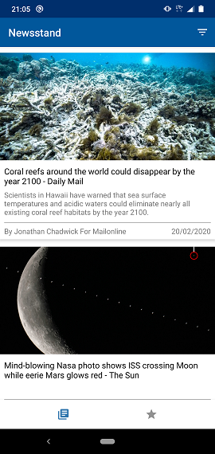
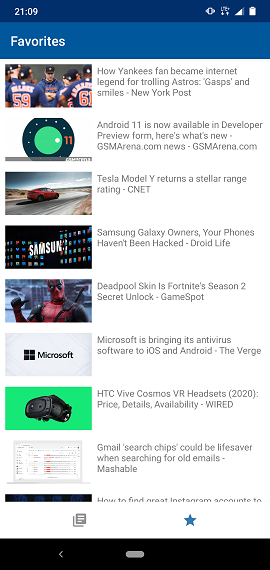
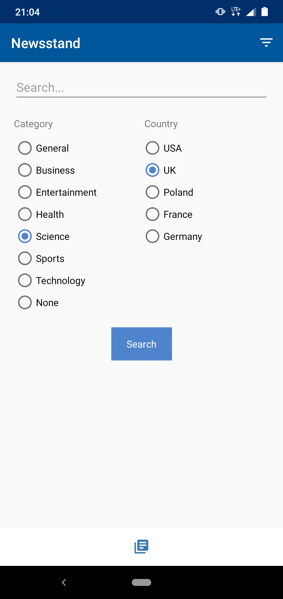
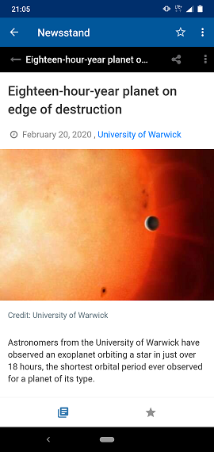

# Newsstand
## Introduction
This is an app that shows latest international news. Articles are fetched from [News API](https://newsapi.org).
There are few data filtering possibilites, i.e. by a keyword, country or category.
## Architecture & libraries
The app is built upon MVVM design pattern and some of Android Jetpack components, e.g. Data Binding, LiveData, Navigation, WebView. Apart of that, some third party libraries were used, e.g. Dagger, Retrofit, Moshi, Glide or Kotlin coroutines.
## Running the app
Get your own [API key](https://newsapi.org/register) and inside gradle.properties replace 
```<your_api_token_from_newsapi_org>``` with obtained key
## Screenshots
 
 

